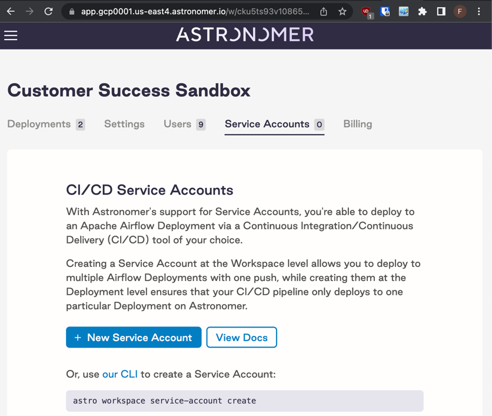
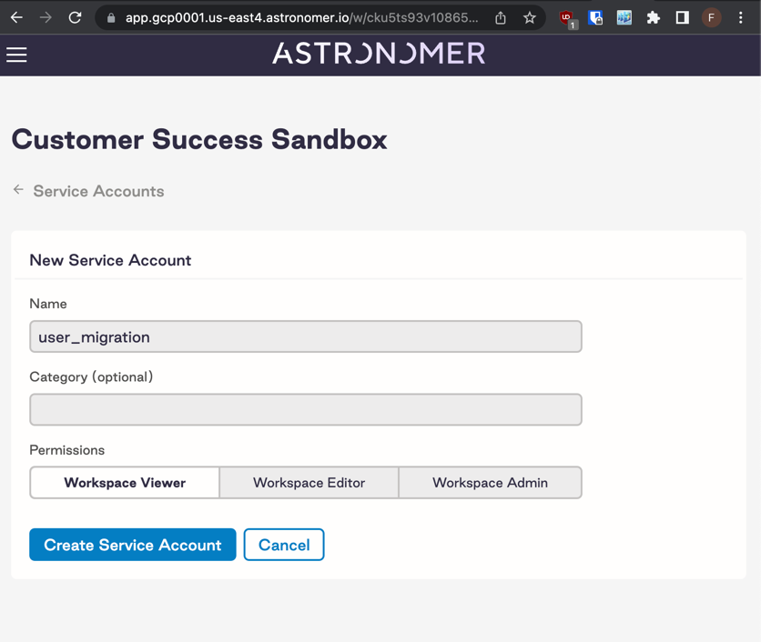
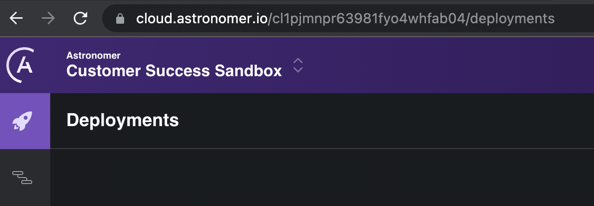
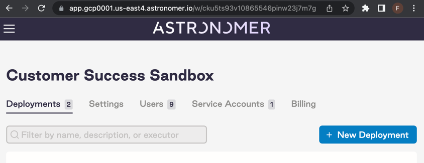
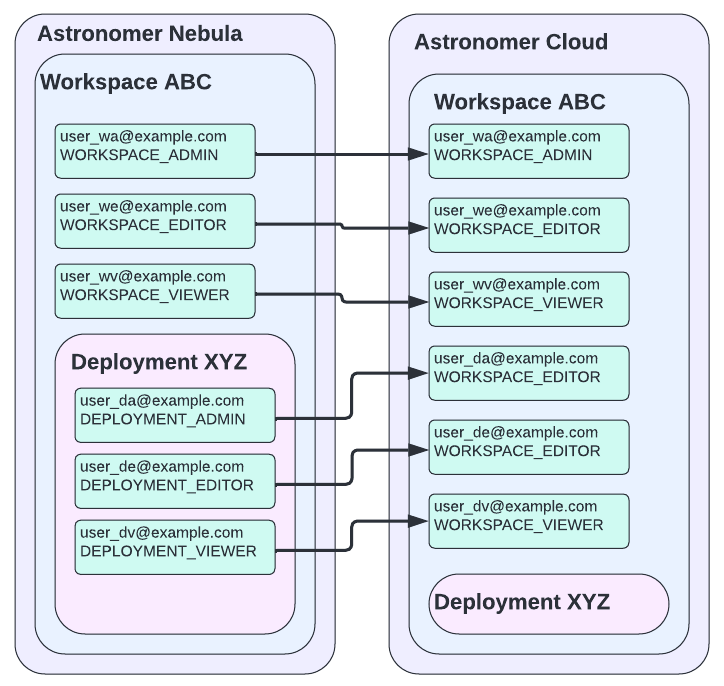

# `astro-apply`
An idempotent `apply` functionality, like `kubectl apply` - but for Astronomer Cloud/Software/Nebula.

Utilizes a `config.yaml` and a GraphQL API to apply a configuration.

*NOTE:* This could is maintained separately from the APIs it utilizes. 
There is no guarantee it will continue to work, nor be fixed promptly if it stops working

# Installation
```shell
pip install git+https://github.com/astronomer/astro-apply.git#egg=astro-apply
```

# Usage
## `fetch`
```shell
astro-apply fetch --help
Usage: astro-apply fetch [OPTIONS]

  Fetch existing configuration from an Astronomer workspace

Options:
  --target-workspace-id TEXT      Target Workspace ID - should look something
                                  like cku5ts93v10865546pinw23j7m7g
                                  [required]
  --source-workspace-id TEXT      Source Workspace ID - should look something
                                  like cku5ts93v10865546pinw23j7m7g
                                  [required]
  -d, --basedomain TEXT           e.g. example.com if you access astronomer
                                  via https://app.example.com. If empty -
                                  defaults to Nebula  [default: gcp0001.us-
                                  east4.astronomer.io]
  -f, --output-file FILE          Output file to write to or merge with
                                  [default: config.yaml]
  -t, --workspace-service-account-token TEXT
                                  Workspace Service Account Token - input
                                  hidden when prompted for  [required]
  -y, --yes                       Skip confirmation prompts
  --help                          Show this message and exit.
```

### Requirements
Requires a 
- Workspace Service Account Token for Astronomer Software or Astronomer Nebula
- (or, instead ) `astro auth login` to be run and user to be authenticated correctly
- `astrocloud auth login` to be run and user to be authenticated correctly

### Obtaining a Workspace Service Account Token for Astronomer Software/Nebula
- navigate to "Service Accounts" to 




## `apply`
*note*: currently only `apply`s against Astronomer Cloud.

```shell
astro-apply apply --help
Usage: astro-apply apply [OPTIONS]

  Apply a configuration to an Astronomer Cloud workspaces

Options:
  -f, --input-file FILE  Input configuration file to read - see README.md for
                         a sample  [default: config.yaml]
  -y, --yes              Skip confirmation prompts
  --help                 Show this message and exit.
```

### Requirements
Requires a 
- `astrocloud auth login` to be run and user to be authenticated correctly

# `config.yaml` Example
```yaml
workspace_abcd1234:
  users:
    username_a: WORKSPACE_ADMIN 
    username_b: WORKSPACE_EDITOR
    username_c: WORKSPACE_VIEWER    
  env:
    AIRFLOW_VAR_ABC: 1234
    MY_ENV_VAR: value1234
    key: value
```

# Environmental Variables
You can use a `.env` file or env variables with `ASTRO_APPLY_*` to replace any named command line options
e.g. 
```shell
astro-apply fetch --source-workspace-id=abcd1234
```
can become 
```shell
ASTRO_APPLY_FETCH_SOURCE_WORKSPACE_ID=abcd1234 astro-apply
```

or 
```shell
$ cat .env
ASTRO_APPLY_FETCH_SOURCE_WORKSPACE_ID=abcd1234 

$ astro-apply
```

# Functionality
- Workspace Users + Roles CRUD
  - Due to API Limitations - only existing organization users can be imported - which will mean that the tool may need to be re-run a number of times
  - additionally - some mapping is required from Astronomer Software/Nebula to Astronomer Cloud - see image in [#user-mapping](#user-mapping)
- Env Variables CRUD

# Future Functionality
- Workspaces CRUD
- Deployments CRUD

# How Do I Find My Workspace Id?
## Astronomer Cloud
In Astronomer Cloud - your workspace ID will be in your URL (e.g. `cl1pjmnpr63981fyo4whfab04` in this screenshot):



## Astronomer Software / Nebula
In Astronomer Software / Nebula - your workspace ID will be in your URL (e.g. `cku5ts93v10865546pinw23j7m7g` in this screenshot):



# User Mapping
Due to there being only Workspace RBAC in Astronomer Cloud - Role Mapping is required:


